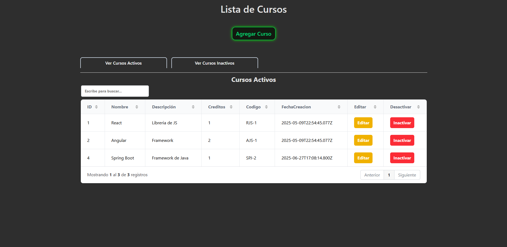
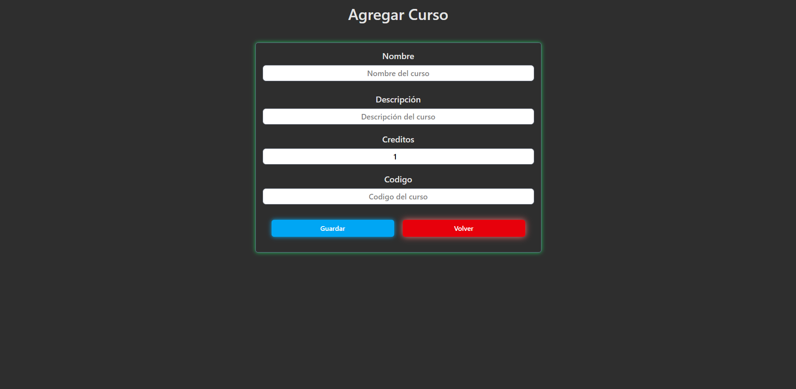
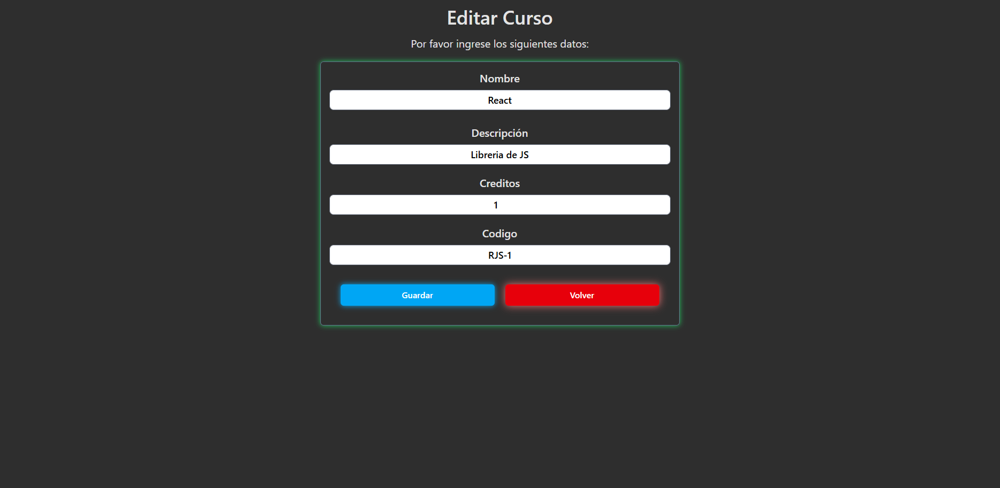

# 📚 Sistema de Gestión de Cursos - Proyecto Full Stack

Este es un proyecto universitario desarrollado como una solución **full stack** para gestionar cursos. Incluye un frontend en React, un backend en Node.js con Express y una base de datos relacional en **SQL Server**.

> 💼 Este repositorio es parte de mi portafolio como desarrollador web para demostrar mis conocimientos en desarrollo full stack.

---

## 🧠 Tecnologías usadas

- **Frontend**: React + Redux
- **Backend**: Node.js + Express  
- **Base de Datos**: SQL Server  
- **Lenguaje SQL**: T-SQL (procedimientos almacenados)

---

## 🚀 Funcionalidades principales

- Crear, leer, actualizar y activar/inactivar cursos.  
- API REST conectada a base de datos mediante stored procedures.  
- Este repositorio contiene un único servicio backend, desarrollado con una arquitectura pensada para microservicios.  
- Comunicación entre capas vía HTTP con JSON.

---

## 🏗️ Arquitectura del proyecto

Este proyecto sigue una arquitectura basada en el patrón **Modelo-Vista-Controlador (MVC)**:

- **Modelo:** Maneja los datos y la lógica de negocio. En este proyecto, corresponde a las funciones y scripts SQL Server que gestionan la base de datos.  
- **Vista:** Es la interfaz de usuario, desarrollada con React, que muestra y permite interactuar con los datos.  
- **Controlador:** El backend con Node.js y Express, que recibe las solicitudes, procesa la lógica y comunica el modelo con la vista.

---


## 🛠️ Estado del proyecto
✔️ Funcionalidad completa local
🚧 Despliegue pendiente (por ser base en SQL Server local)
📦 Proyecto organizado y funcional para revisar código o probar local
🎨 El diseño del frontend está enfocado en la funcionalidad. No es completamente responsive ni centrado en el aspecto visual.

---

## 📁 Estructura del repositorio
sistema-cursos-fullstack/
├── frontend/ # Aplicación de React
├── backend/ # API REST con Node.js + Express
├── db/ # Scripts SQL Server
└── README.md # Este archivo

---

## ⚙️ Cómo ejecutar el proyecto localmente
### 1. Clonar el repositorio
Podés usar cualquiera de los siguientes comandos, según cómo tengas configurado Git:

**Con SSH**
```bash
git clone git@github.com:Elitaxh06/react-starter-setup.git
```

**Con HTTPS**
```bash
git clone https://github.com/Elitaxh06/react-starter-setup.git
```
## Configurar la base de datos (SQL Server)
### 1. Abrí SQL Server Management Studio (SSMS).
### 2. Ejecutá los scripts dentro de la carpeta /db en este orden:
```bash
01_create_tables.sql  
02_insert_data.sql  
03_sp_insert.sql  
04_sp_read_simple.sql  
05_sp_read_with_id.sql  
06_sp_update_logical.sql  
07_sp_update_total.sql 
```
### 3.Backend (Express)
```bash
cd backend
npm install
npm run start
```
⚠️ Recordá configurar tu conexión en un archivo .env:
env
PORT = 3005
DB_SERVER=localhost  
DB_USER=tu_usuario  
DB_PASSWORD=tu_contraseña  
DB_DATABASE=nombre_de_tu_bd

### 4. Frontend (React)
```bash
cd frontend
npm install
npm run dev
```
Abrí tu navegador en http://localhost:5173/

---

## 🎯 Objetivo
#### Este proyecto demuestra mi capacidad para:
Construir una arquitectura full stack desde cero
Conectar frontend moderno con backend REST
Usar SQL Server y stored procedures de forma estructurada
Aplicar buenas prácticas de desarrollo web
Manejar estado global con React y Redux para una mejor experiencia de usuario

---
## 🙋 Sobre mí
### Hola, soy Esteban Pizarro, desarrollador web junior con enfoque en frontend y conocimientos en backend.
Siempre estoy aprendiendo cosas nuevas y busco oportunidades para aplicar y crecer profesionalmente.

### 🌐 Portafolio: https://elitaxh.dev 
### 📫 Contacto: https://www.linkedin.com/in/esteban-pizarro-5897362a9/ 

---
## 📸 Capturas





---
## 📄 Licencia
Uso académico. Podés revisar el código, inspirarte o adaptarlo, siempre que se cite al autor.